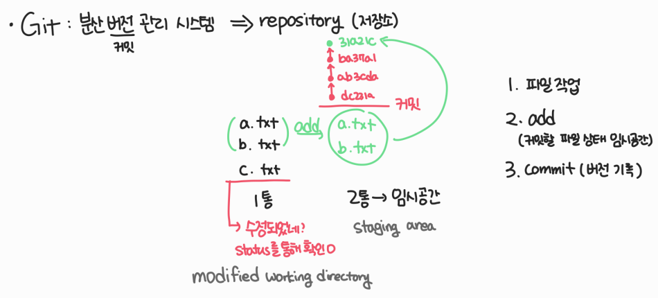
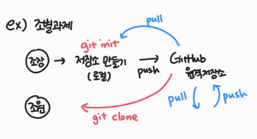
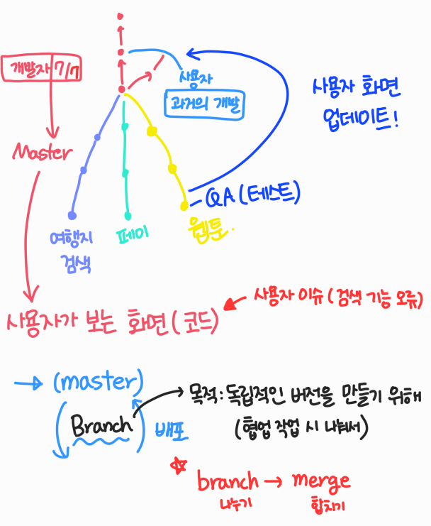
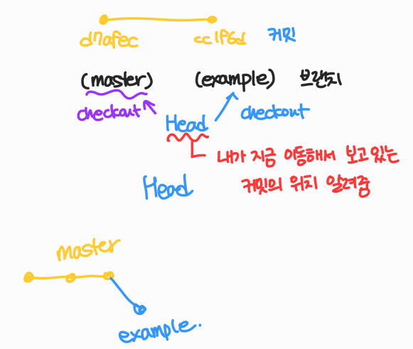
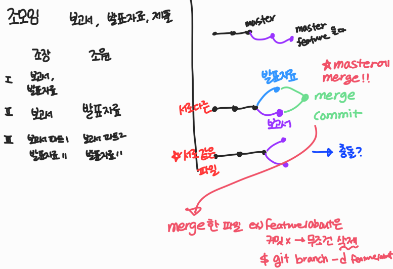

> 배운 것 복습 정리



 

> 내용 들어가기 전 중요사항😁

- 커밋한 파일을 github에서 이름을 바꾸고 싶다면

로컬에서 폴더를 지우고 커밋한 다음 push

파일 삭제 →git status →git add . →git commit -m ""


😝**파일 수정, 파일 이름 바꾸기, 폴더 이름 바꾸기, 생성 이동 등등 **

**원래 하던대로 하고 커밋한 다음 push 하기**


- 커밋메세지 다르게 하고 싶다면 add . X => 각각의 파일 add하기


- Github에서 TIL (ex) 폴더 이름을 바꾸고 싶다면 경로도 바꿔주기


- 마크다운 이미지 경로 이슈

  경로가 바뀐 이미지를 넣어주면 된다!!

- README.md 의 이름을 폴더에서 바꾼다면 

  README.md에서의 경로도 바꾸기

   

✍**터미널 청소 단축키**

cmd면 `cls`

bash면 `cntl+L`



### Git Clone

> 저장소 복제

```bash
$ git clone <url>
```

🙄*clone하면 원격 저장소 이름의 폴더가 생성*  

*데스크탑이 아닌 생성 폴더에서  git bash작업해야함!!!*


압축 파일은 최신 버전의 파일/폴더만 가지고 오는 것(master X)

클론은 git 저장소를 가져오는 것(master O)

(**push 권한 없음!!!**)

```bash
$ git pull origin master #clone한 것의 업데이트 받아옴
```

(커밋X => 충돌됨)


🙄***pull과 clone의 차이점***   ( *공통점 : 둘 다 받아옴* )

**pull  **:  변경된 커밋을 받아옴

**clone**  :  저장소를 받아옴


🙄*push와 pull로 협업 가능*

😅 git status 가 된 파일들만 add 됨

---

### Git Flow

> Git을 활용하여 협업하는 흐름으로 branch를 활용하는 전략




### Git Branch

> 독립적인 버전을 만들기 위해서(목적)



- 주요 명령어

  ```bash
  (master) $ git branch {branch name}   #브랜치 생성
  
  (master) $ git checkout {branch name}  #브랜치 이동
  
  (master) $ git checkout -b {branch name}  #브랜치 생성 및 이동
  
  (master) $ git branch  #브랜치 목록
  
  (master) $ git branch -d {branch name}  # 브랜치 삭제
  ```


- 순서

```bash
#루트 커밋 완성시킨 후
(master) $ git branch #브랜치 조회
(example)$ git branch <brnach name> (example)#브랜치 생성
(example)$ git checkout <branchname>(example) #브랜치 이동
$ git status
$ git add .
$ git commit -m
$ git log --oneline
$ git checkout master
$ git log --oneline (example이 없어짐) example로 돌아가면 두 개의 버전이 나옴
$ git checkout example (master에 있던 것까지 보임)
```


---

### Branch Merge

> branch 작업 후 합칠 때 사용하는 명령어

```   bash
$ git merge branchname (example) #병합
```



*병합 후엔  branch 삭제하기(master가 아닌 다른 브랜치)*

`git branch -d 브랜치이름` : 브랜치 삭제


 💡 **병합이 완료됐을 때 브랜치를 지우면 커밋도 지워지는지?  **

​      x ,  branch master에 합쳐놔서 상관없음


🙄`git status ` - merge 충돌 확인 가능 

log는 아님(아직 커밋 안 함)


> 상황 1.  fast-forward

- 다른 브랜치를 생성 및 이동
- init, add. , commit, log 작업 후 git checkout master
- master에 병합하기


> 상황 2. merge commit (서로 다른 파일이 수정되어 있는 상황)

- 다른 브랜치를 생성 및 이동
- init, add. , commit, log 작업 후 git checkout master
- master에 추가 후 commit 발생시킨 후 master에 merge 하기


> 상황 3. master에 있던 readme를 다른 브랜치에서 수정==== 각자 커밋이 있는데 같은 파일의 동일한 부분을 수정한 것

-master에 있는ㅇ황 readme를 feature/test(브랜치이름)에서 수정 후 checkout master로 와서 master에서 git add .하기 → 충돌 발생


충돌 발생(merge conflict 발생 )하면

```bash
(master) $ git merge feature/test 
Auto-merging README.md
CONFLICT (content): Merge conflict in README.md
Automatic merge failed; fix conflicts and then commit the result.
```

```bash
git status

git add .

git commit #메세지창 닫으면 merging 사라짐
```


**git log 결과는 상황2와 같음**

충돌을 고쳐서 commit enter 했다

---


#### Fork&Pull Request

- fork 방법
  1.  GitHub에서 fork 누르기
  2. 저장될 원격저장소 이름 확인하고 자신의 원격저장소에서 확인
  3. clone하고 branch 생성
  4. 해당 폴더에 내용 추가하고 커밋 후 push 하기
  5. create&pull request 하기


✔master가 아니면 merge 불가능

fork해서 만든 것은 origin이 본인이다 (master 아님)


✔vs code 는 지워져도 cntl+z 가능


`git restore <파일이름>` : 이전 상태로 돌아가기