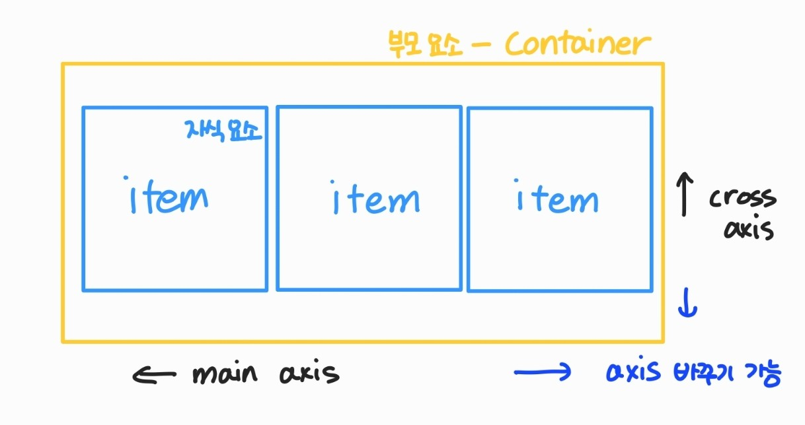

### CSS 원칙

1. Normal Flow(네모 박스 모델, 좌측 상단에 배치)
2. position으로 위치의 기준 변경


## CSS Position

> 문서 상에서 요소의 위치를 지정 => 항상 좌측상단에 있기 때문에 position으로 아래로 불러온다


#### static : 모든 태그의 기본 값(기준 위치)

- 일반적인 요소의 배치 순서에 따름(좌측 상단)
- 부모 요소 내에서 배치될 때는 부모 요소의 위치를 기준으로 배치

- 좌표 프로퍼티(top, bottom, left, right) 를 사용하여 이동 가능


#### 1. relative : 상대 위치

- (normal flow 유지) => 실제 위치는 그대로, 사람 눈에만 이동(**본인의 원래 위치**)

 - 레이아웃에서 요소가 차지하는 공간은 static일 때와 같음


#### 2. absolute : 절대 위치

- (normal flow에서 벗어남) => 더이상 그 위치에 없음(ex: 특정 영역 위에 있음, 좌측상단X)

 - static이 아닌 가장 가까이 있는 부모/조상 요소를 기준으로 이동(없는 경우 브라우저 화면 기준으로 이동) => **특정 부모의 위치**


#### 3. fixed : 고정 위치

- 고정 위치(화면의 위치) => 자신의 공간 X

 - 부모 요소와 상관 없이 화면 기준(ex: 우측 하단에 계속 있는 메뉴)


#### 4. sticky 

- 기본적으로 static이나 스크롤 이동에 따라 fixed로 변경 (자신의 공간을 가지고 있음) ex. 위에 상태바가 계속 있는 경우


## CSS Layout

- Display
- Position
- Float(CSS1, 1996)
- Flexbox


- Float 
  - 박스를 왼쪽 혹은 오른쪽으로 이동시켜 텍스트를 포함 인라인요소들이 주변을 wrapping 하도록 함
  - 요소가 Normal flow 벗어나도록 함


## Flexbox

> 행과 열 형태로 아이템들을 배치하는 1차원 레이아웃 모델

- 축
  - main axis(메인 축)
  - cross axis(교차 축)

- 구성 요소
  - Flex Container(부모 요소)
  - Flex item(자식 요소)


#### Flex Container(부모 요소)

- `display: flex;`는 부모 요소에 넣기, 자식 요소는 자연스럽게 item이 된다
- flexbox 레이아웃을 형성하는 가장 기본적인 모델
- Flex item이 모여있는 형태
- display 속성을 flex 혹은 inline-flex로 지정

#### Flex item(자식 요소)

- 컨테이너에 속해 있는 컨텐츠(박스)



*=> 수동 값 부여 없이 수직정렬과 아이템의 너비와 높이 혹은 간격을 동일하게 배치하기가 어려웠다*


❤참고사이트!!

[flex를 이용한 div 배치]([[CSS\] Flex를 사용하여 DIV 예쁘게 배치하기 (Container 편) — Wooncloud Blog (tistory.com)](https://wooncloud.tistory.com/10))

###  속성

#### flex-direction

> 역방향의 경우 HTML 태그 선언 순서와 시각적으로 다르니 유의 (웹 접근성에 영향)

1. `row` (메인축 : 가로) : 아이템들을 텍스트의 방향과 동일하게 정렬
2. `row-reverse` : 아이템들을 텍스트의 반대 방향으로 정렬
3. `column` (메인축 : 세로) : 아이템들을 위에서 아래로 정렬
4. `column-reverse` : 아이템들을 아래에서 위로 정렬


#### flex-wrap

- 아이템이 컨테이너를 벗어나는 경우 해당 영역 내에 배치되도록 설정 (기본적으로 컨테이너를 벗어나지 않게 함 )
  1. `wrap` : 여러 줄에 걸쳐 정렬
  2. `nowrap` : 모든 아이템들을 한 줄에 정렬
  3. `wrap-reverse`: 아이템들을 여러 줄에 걸쳐 반대로 정렬


- `flex-flow` : flex-direction과 flex-wrap을 한꺼번에 지정할 수 있는 단축 속성
  - `flex-flow: row wrap`: 아이템들을 가로선 상의 여러줄에 걸쳐 정렬하기 위해
  - `flex-flow: column wrap;` : 세로


 #### justify-content => 공간 배분

```css
.pond{
	display: flex; 
	justify-content: flex-start;
}
```


1. `flex-start` : 아이템들을 컨테이너의 **왼쪽** 정렬
2. `flex-end` : 아이템들을 컨테이너의 **오른쪽** 정렬
3. `center` :아이템들을 컨테이너의 **가운데**로 정렬
4. `space-between` : 아이템들 **사이에 동일**한 간격
5. `space-around` : 아이템들 **주위에 동일**한 간격
6. `space-evenly` : 양끝 아이템의 바깐 공간 포함 해 아이템 사이에 동일한 간격의 여유 공간


#### align-items(cross axis 기준)

```css
.pond{
	display: flex; 
	align-items: flex-end;
}
```


1. `stretch` : 아이템들을 컨테이너에 맞도록 **늘림**
2. `flex-start `: 아이템들을 컨테이너의 **꼭대기로 정렬**
3. `flex-end `: 아이템들을 컨테이너의 **바닥으로 정렬**
4. `center `: 아이템들을 컨테이너의 **세로선 상의 가운데로 정렬**
5. `baseline` : 아이템들을 컨테이너의 **시작 위치에 정렬**


- `align-self` => 개별 아이템에 적용할 때(align-items에서 사용하는 값을 씀)
- `flex-grow` : 남은 영역을 아이템에 분배 
- `order` : 시각적 배치 순서
  - order:-1;  order:-1;


*좌우로 가운데에 정렬하려면 justify-content center, align-items center하면 됨*

🐸[flex 연습하는 게임](https://flexboxfroggy.com/#ko)
